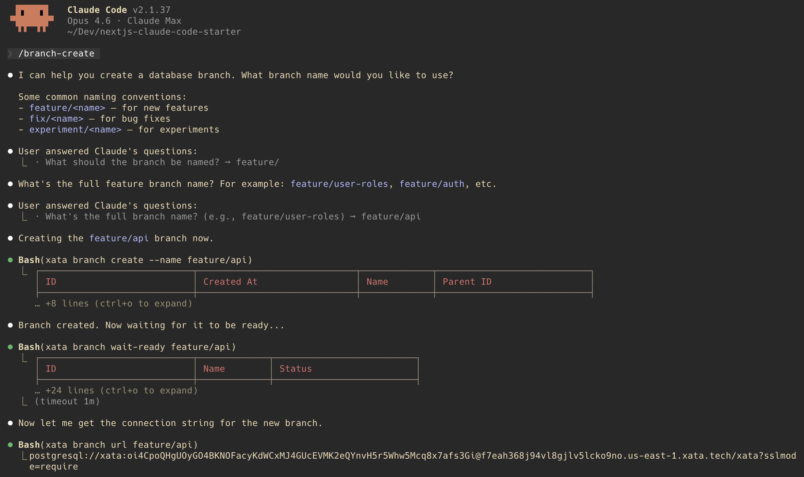

<div align="center">
  <a href="https://xata.io">
    
  </a>

  <h1>Next.js + Xata + Claude Code Starter</h1>

  <p>
    <strong>Production-ready Next.js + Postgres starter for AI apps. Zero-downtime migrations, instant database branches, PII-safe prod clones, and 6 Claude Code skills.</strong>
  </p>

  <p>
    <a href="https://xata.io/blog/building-production-ai-apps-with-xata-and-claude-code">Tutorial</a> ·
    <a href="https://xata.io/documentation">Docs</a> ·
    <a href="https://github.com/xataio/pgroll">pgroll</a>
  </p>

  <p>
    <a href="https://vercel.com/new/clone?repository-url=https%3A%2F%2Fgithub.com%2Fxataio%2Fnextjs-claude-code-starter&env=DATABASE_URL&envDescription=Connection%20string%20from%20%60xata%20branch%20url%60&envLink=https%3A%2F%2Fxata.io%2Fdocumentation%2Fcli&project-name=nextjs-claude-code-starter&repository-name=nextjs-claude-code-starter">
      
    </a>
  </p>
</div>

---

## Features

- ⚡ **Zero-downtime migrations** with pgroll's expand-contract pattern (old and new schemas serve traffic simultaneously)
- 🌳 **Instant database branches** via copy-on-write (ready in seconds, no storage duplication)
- 🔒 **Anonymized production clones** with referential integrity preserved across foreign keys
- 🤖 **6 Claude Code skills** for branch, migrate, clone, and rollback workflows
- 🐘 **Next.js 14 + raw Postgres** (no ORM, raw `postgres` driver)
- 📦 **MIT licensed**, ready to fork

## Claude Code skills

Open Claude Code in this directory and use these slash commands, or describe the workflow in plain English and Claude Code will run the right Xata CLI sequence.

| Command | Description |
| --- | --- |
| `/project:setup` | Connect to Xata and configure the project |
| `/project:branch-create` | Create an isolated database branch |
| `/project:migration-start` | Start a zero-downtime migration |
| `/project:migration-complete` | Complete an ongoing migration |
| `/project:migration-rollback` | Roll back a failed migration |
| `/project:clone-production` | Clone production with PII anonymization |

[](public/xata-claude-branch-demo.png)

*Claude Code running `/branch-create`: names the branch, creates it, waits for ready, and returns the connection string.*

The skills are markdown files in `.claude/skills/`. Fork them, extend them, or write your own for other workflows.

---

## Prerequisites

- Node.js 18+
- A [Xata account](https://console.xata.io/)
- [Xata CLI](https://xata.io/documentation/cli) installed

## Quick start

### 1. Clone and install

```bash
git clone https://github.com/xataio/nextjs-claude-code-starter
cd nextjs-claude-code-starter
npm install
```

### 2. Install the Xata CLI

```bash
curl -fsSL https://xata.io/install.sh | bash
export PATH="$HOME/.config/xata/bin:$PATH"
```

### 3. Connect to Xata

```bash
xata auth login
xata init
```

Follow the prompts to select your organization, project, and branch.

### 4. Set up your environment

```bash
xata branch url
# Copy the connection string
cp .env.example .env.local
# Open .env.local and paste the connection string as the value of DATABASE_URL
```

### 5. Initialize pgroll and run migrations

```bash
xata roll init
xata roll start migrations/001_create_users.yaml
xata roll complete
xata roll start migrations/002_add_role.yaml
xata roll complete
xata roll start migrations/003_add_teams.yaml
xata roll complete
```

`roll init` is a one-time setup. Each `roll start` begins the **expand phase** (both old and new schemas serve traffic), and `roll complete` runs the **contract phase** (old schema removed).

### 6. Start the app

```bash
npm run dev
```

You'll see users and teams tables, empty but with the correct columns. Add a test user:

```bash
psql $(xata branch url) -c "INSERT INTO users (email, name) VALUES ('test@example.com', 'Test User');"
```

---

## Project structure

```
.
├── .claude/skills/       # Claude Code slash command skills
├── migrations/           # pgroll migration files (YAML)
│   ├── 001_create_users.yaml
│   ├── 002_add_role.yaml
│   └── 003_add_teams.yaml
├── src/
│   ├── app/              # Next.js app router
│   └── lib/              # Database connection (postgres driver)
├── .env.example
└── package.json
```

---

## Xata CLI reference

| Command | What it does |
| --- | --- |
| `xata auth login` | Authenticate with Xata |
| `xata init` | Link project to current folder |
| `xata branch create --name <name>` | Create an isolated database branch |
| `xata branch wait-ready <name>` | Wait for a branch to be ready |
| `xata branch url [branch]` | Get connection string |
| `xata roll init` | One-time pgroll setup |
| `xata roll start <file>` | Begin expand phase (both schemas live) |
| `xata roll complete` | Contract phase (old schema removed) |
| `xata roll status` | Check migration progress |
| `xata roll rollback` | Undo expand phase if needed |
| `xata clone start --source-url <url>` | Clone with PII anonymization |

---

## Acknowledgments

Built on the shoulders of:

- [pgroll](https://github.com/xataio/pgroll) — Apache 2.0, zero-downtime Postgres migrations
- [pgstream](https://github.com/xataio/pgstream) — Apache 2.0, Postgres replication and anonymization
- [Claude Code](https://docs.claude.com/en/docs/claude-code/overview) — agentic CLI workflows
- [Next.js](https://nextjs.org/) — the React framework

## Learn more

- [Building Production AI Apps with Xata and Claude Code](https://xata.io/blog/building-production-ai-apps-with-xata-and-claude-code) (tutorial)
- [Xata Documentation](https://xata.io/documentation)
- [pgroll on GitHub](https://github.com/xataio/pgroll)
- [Data Anonymization](https://xata.io/documentation/core-concepts/data-anonymization)

## License

[MIT](LICENSE)
